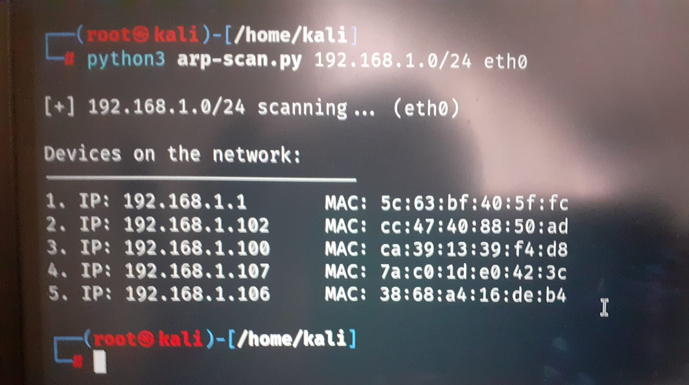

# ARP Scanner 🕵️‍♂️

A simple Python script to scan devices in your local network using ARP requests.  
It shows the IP and MAC addresses of all devices that respond.

---

## Features ✅

- Scan an IP range on a specified interface.
- Display IP and MAC addresses of active devices.
- Lightweight and easy to use via command line.

---

## Installation 💻

1. Make sure you have **Python 3.x** installed.
2. Install the required Python library:

```bash
pip install scapy
```

---

## Usage 🚀

```bash
python3 arp-scan.py <IP-range> <interface>
```

**Example:**

```bash
python3 arp-scan.py 192.168.1.0/24 eth0
```

- `<IP-range>` → Target IP range (e.g., `192.168.1.0/24`)  
- `<interface>` → Network interface to use (e.g., `eth0`, `wlan0`)

---

## Screenshots 📸

Here’s an example of the script in action:




---

## Notes ⚠️

- Only devices that respond to ARP requests will be shown.
- Works best on local networks.
- Requires administrative/root privileges on some systems to send ARP requests.


